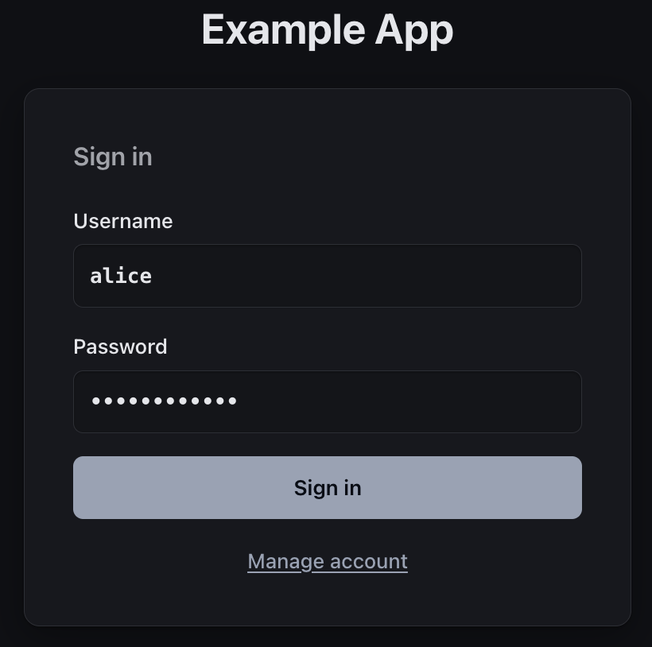
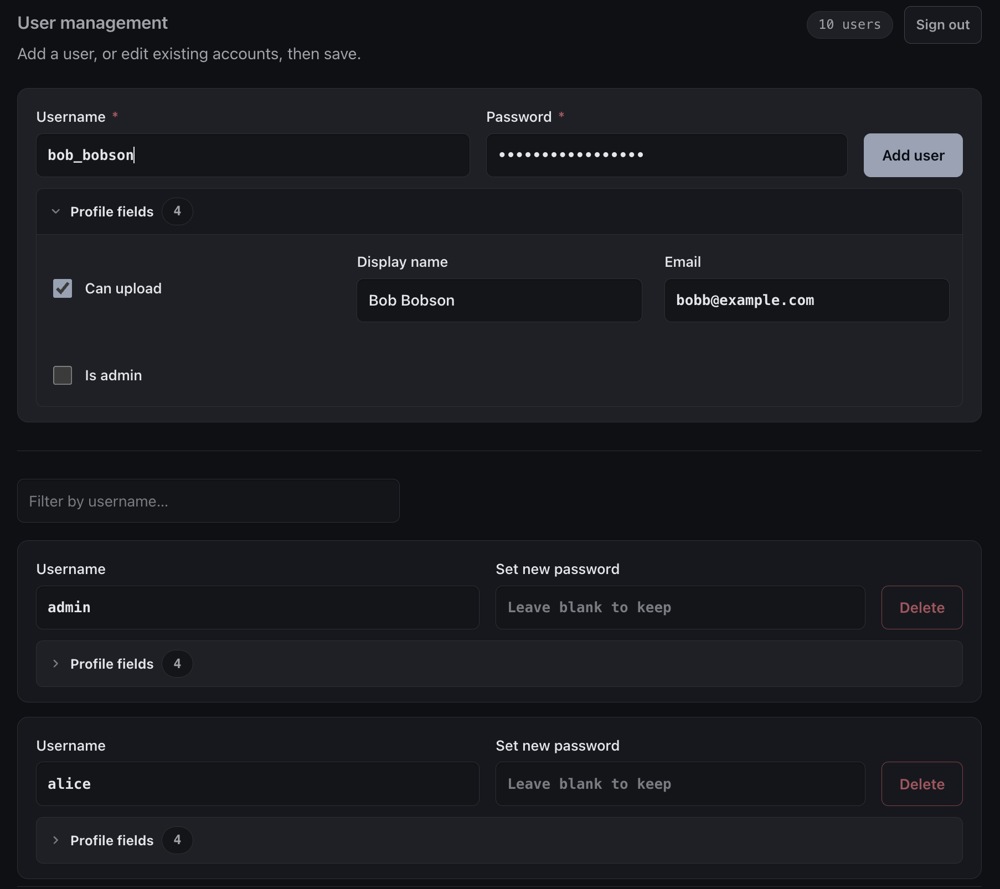
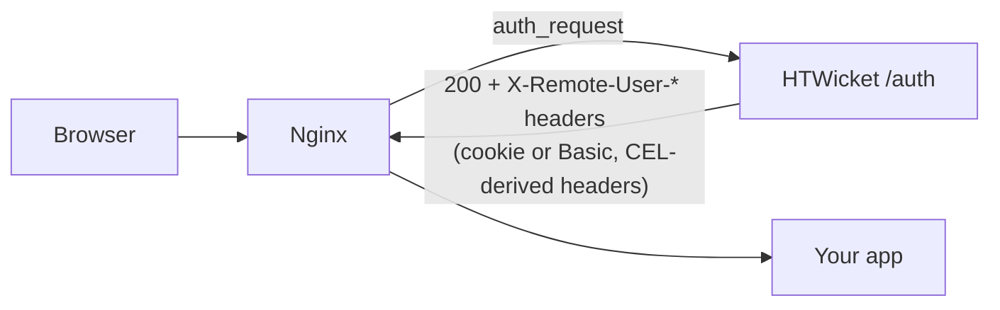

# HTWicket – Modern JWT auth against `.htpasswd` for Nginx/Caddy/others + admin GUI for user/group management

Optionally upgrades password hash to bcrypt/argon2 on login, and provides additional user metadata in JWT cookie. 

<table><tr>
<td width="50%">
Login form authenticates against .htpasswd:

</td>
<td width="50%">
Admin UI for user management with custom fields:

</td>
</tr></table>

- **Backwards compatible**: verifies existing `.htpasswd` files as-is (DES crypt, `$apr1$`,
  `$1$`, `$5$`/`$6$`, bcrypt, argon2). Writes bcrypt by default, so the file stays usable with
  plain nginx `auth_basic` as an escape hatch; opt into even more secure `argon2id` if you don't need that.
- **Modern sessions**: login form + JWT cookie (real logout, sliding expiry, sessions end on
  password change). Optional `Authorization: Basic` passthrough for scripted clients.
- **Custom user attributes**: declare fields in config (`is_admin`, `can_upload`, ...),
  manage them as checkboxes/inputs in the built-in admin UI, expose them to your app as
  headers/JWT claims via [CEL expressions](https://cel.dev).
- **Self-service support**: Users can change their password and edit (only) the fields you allow.
- **Minimal**: one binary, all templates/CSS/translations embedded; config from TOML +
  env vars; offline CLI for user management and lockout recovery; no JS, no runtime assets, no DB.

## Overview graph



```
Routes:
  /login     - login form
  /logout    - terminate session
  /account   - self service page
  /admin     - manage users and attribs
  /healthz   - service status

Files:
  .htpasswd (password hashes)
  .htwicket.toml (extta metadata)
```

## Quick start

Demo with Docker:

`make demo` builds a throwaway Docker container — HTWicket behind
nginx guarding a demo app — at <http://localhost:8080/>. See [demo/README.md](demo/README.md).

Install on Debian / Ubuntu:

```sh
dpkg -i <.deb package>
sudo $EDITOR /etc/htwicket.toml        # edit htpasswd_file, superadmins, fields…
sudo htwicket user add admin           # prompts for a password
sudo systemctl enable --now htwicket   # or: htwicket serve
```

Then point nginx at it — see [docs/deployment.md](docs/deployment.md). Annotated config:
[htwicket.example.toml](htwicket.example.toml).

## Documentation

- [auth-flow.md](docs/auth-flow.md) — how a request is authenticated, step by step; the session JWT lifecycle.
- [configuration.md](docs/configuration.md) — config layering, the field/header/claim schema + CEL, state files.
- [deployment.md](docs/deployment.md) — nginx wiring, the `.deb`/systemd install, the CLI, lockout recovery.
- [security.md](docs/security.md) — threat model and the security decisions behind it.
- [architecture.md](docs/architecture.md) — stack, module map, testing, non-goals & extension seams.
- [translating.md](docs/translating.md) — translate the UI (gettext workflow).

## License
MIT OR Apache-2.0, at your option. Contributions must be compatible with both.
(c) 2026 by Jarno Elonen <elonen@iki.fi>
